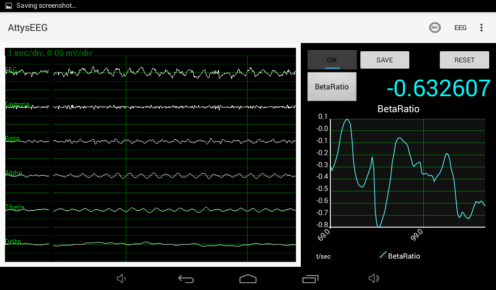
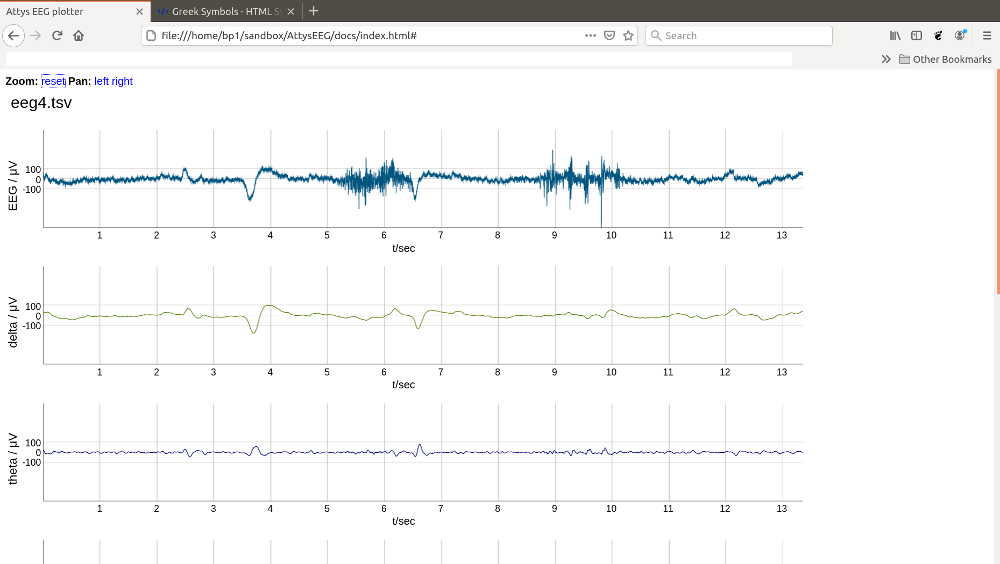

# AttysEEG

EEG app for [Attys](http://www.attys.tech)

## Features

* Plot of Raw EEG data at 250Hz or 500Hz sampling rate
* Plot of alpha, gamma, delta, beta and theta waves
* Visually evoked potentials
* Acoustically evoked potentials (with custom stimulus)
* Beta ratio and PowerFastSlow, used in depth of anaesthesia
* Histogram amplitudes of alpha, gamma, delta, beta and theta waves
* Saves the raw data and the filtered frequency bands
* Works on a wide range of screens form tablets to mobile phones

## Google play

## Data format of the datafile

One sample per line. Columns:

  0. time in sec
  1. raw EEG / V
  2. filtered EEG / V
  3. delta waves / V
  4. theta waves / V
  5. alpha waves / V
  6. beta waves / V
  7. gamma waves / V

## EEG viewer

Click on the screenshot below and drop an AttysEEG file on the page.

